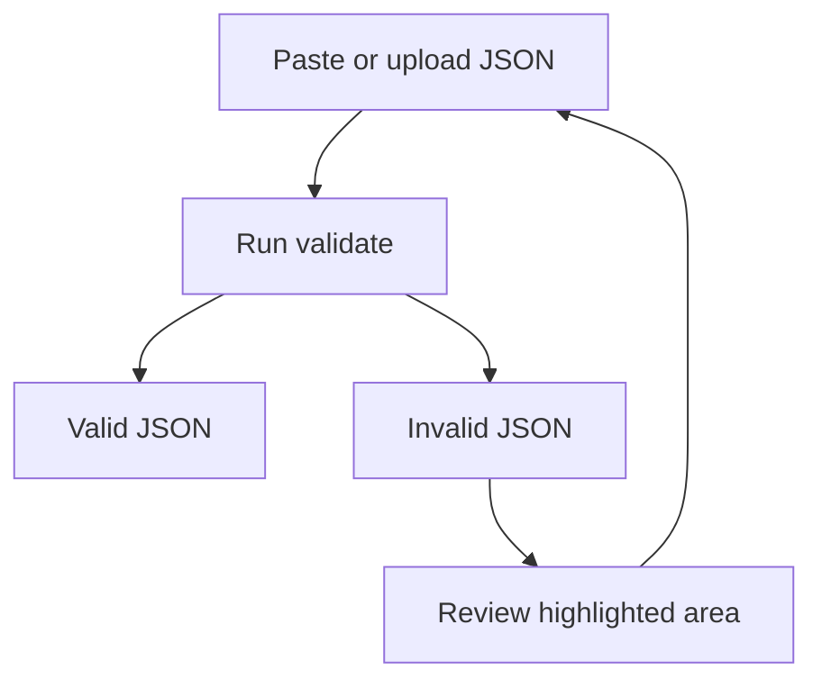

## Overview

JSONViewer.AI is a free online JSON viewer, validator, and beautifier that runs entirely in your browser. You paste or upload JSON, then use syntax highlighting and an interactive tree view to explore, validate, and format data without sending it to a server.

If you are new to JSONViewer.AI, start with the [Introduction](/introduction) and [Quickstart](/quickstart), then return here for more detail.

<Columns cols={3}>
  <Card title="View JSON" icon="search" href="#viewing-json">
    Explore nested objects and arrays with syntax highlighting and tree view.
  </Card>
  <Card title="Validate Structure" icon="alert-triangle" href="#validating-json">
    Check JSON syntax instantly and locate structural errors.
  </Card>
  <Card title="Beautify & Minify" icon="code" href="#beautifying-json">
    Reformat JSON for readability or compress it for compact sharing.
  </Card>
</Columns>

<Callout kind="info">

All validation and beautification in JSONViewer.AI are processed locally in your browser. Your JSON is not uploaded to a server.

</Callout>

## Viewing JSON effectively {#viewing-json}

Viewing JSON is about making complex, nested data easy to read. JSONViewer.AI gives you:

- A text view with syntax highlighting.
- A tree view to expand or collapse nested structures.

<Steps>
  <Step title="Open your JSON" icon="clipboard">
    
Paste or upload your JSON into the main editor area. You can use data from an API response, a log file, or a configuration export.

  </Step>
  <Step title="Use syntax highlighting" icon="monitor">
    
Review the JSON in the text editor with syntax highlighting for keys, values, strings, numbers, and booleans. This makes patterns and mistakes easier to spot visually.

  </Step>
  <Step title="Explore with tree view" icon="chevron-right">
    
Switch to or enable the tree view to see your JSON as expandable nodes. Click on objects and arrays to expand nested levels and inspect specific sections without scrolling through the entire document.

  </Step>
</Steps>

Here is an example of a typical API response that benefits from tree view and syntax highlighting:

<CodeGroup tabs="Minified view,Readable view">
  ```json
  {"user":{"id":42,"name":"Alice","details":{"email":"alice@example.com","plan":"pro"},"projects":[{"id":101,"name":"Website"},{"id":102,"name":"Mobile App"}]}}
  ```
  ```json
  {
    "user": {
      "id": 42,
      "name": "Alice",
      "details": {
        "email": "alice@example.com",
        "plan": "pro"
      },
      "projects": [
        {
          "id": 101,
          "name": "Website"
        },
        {
          "id": 102,
          "name": "Mobile App"
        }
      ]
    }
  }
  ```
</CodeGroup>

<Callout kind="tip">

Use the readable view together with the tree view: scan structure in the tree, then look at exact values and formatting in the highlighted text editor.

</Callout>

## Validating JSON structure {#validating-json}

Validation checks whether your JSON is structurally correct. JSONViewer.AI validates in your browser and points you to syntax problems so you can fix them quickly.

<Steps>
  <Step title="Paste or load JSON" icon="clipboard">
    
Place your JSON in the editor using paste or file upload.

  </Step>
  <Step title="Click validate" icon="check-circle">
    
Click the Validate action. JSONViewer.AI parses the input locally and checks for structural issues such as missing commas or unmatched braces.

  </Step>
  <Step title="Review validation result" icon="info">
    
If the JSON is valid, you can safely move on to viewing or beautifying. If it is invalid, the tool highlights the problematic area so you can correct it.

  </Step>
</Steps>



### Examples of valid and invalid JSON

<Tabs>
  <Tab title="Valid JSON" icon="check-circle">
    
```json
{
  "product": {
    "id": 1001,
    "name": "Wireless Mouse",
    "price": 24.99,
    "inStock": true,
    "tags": [
      "accessory",
      "wireless"
    ]
  }
}
```

This JSON is structurally correct and will pass validation.

  </Tab>
  <Tab title="Invalid JSON" icon="x-circle">
    
```json
{
  "product": {
    "id": 1001,
    "name": "Wireless Mouse",
    "price": 24.99,
    "inStock": true, // Trailing comma is not allowed in JSON
  }
}
```

This JSON will fail validation because of the trailing comma after `"inStock": true`. JSONViewer.AI will point you to this area so you can remove the extra comma.

  </Tab>
</Tabs>

<Callout kind="tip">

Validate JSON before pasting it into configuration files, HTTP requests, or scripts. This helps you avoid runtime errors and makes issues easier to debug.

</Callout>

If you are unsure whether your issue is related to JSON format or something else, check the common questions in the [FAQ](/faq).

## Beautifying and minifying JSON {#beautifying-json}

Beautification reformats JSON to be easier to read. Minification removes unnecessary whitespace to make JSON as compact as possible.

### Beautifying JSON

Use beautify when you want to:

- Review complex payloads comfortably.
- Share readable snippets with teammates.
- Prepare JSON for code reviews or documentation.

<Steps>
  <Step title="Start from raw JSON" icon="terminal">
    
Paste or upload your raw or minified JSON into the editor.

  </Step>
  <Step title="Click beautify or view" icon="play-circle">
    
Use the Beautify or View action to reformat the JSON. JSONViewer.AI will automatically indent and add line breaks while preserving the data.

  </Step>
  <Step title="Copy the formatted result" icon="copy">
    
Copy the beautified JSON for use in your editor, version control, or API testing tool.

  </Step>
</Steps>

<Expandable title="Example: Before and after beautification" default-open="true">

<CodeGroup tabs="Before (minified),After (beautified)">
  ```json
  {"items":[{"id":1,"name":"Notebook","price":6.5},{"id":2,"name":"Pencil","price":1.25}],"currency":"USD","total":7.75}
  ```
  ```json
  {
    "items": [
      {
        "id": 1,
        "name": "Notebook",
        "price": 6.5
      },
      {
        "id": 2,
        "name": "Pencil",
        "price": 1.25
      }
    ],
    "currency": "USD",
    "total": 7.75
  }
  ```
</CodeGroup>

</Expandable>

<Callout kind="success">

Beautification is especially helpful right after validating: once the structure is correct, you can instantly convert it into a clean, readable format.

</Callout>

### Minifying JSON

Minification removes line breaks and extra spaces so you can:

- Reduce payload size for storage or transmission.
- Embed JSON in places where compact text is preferred.

<Expandable title="Example: Beautified vs. minified JSON" default-open="false">

<CodeGroup tabs="Beautified,Minified">
  ```json
  {
    "user": {
      "id": 42,
      "name": "Alice",
      "roles": [
        "admin",
        "editor"
      ]
    },
    "active": true
  }
  ```
  ```json
  {"user":{"id":42,"name":"Alice","roles":["admin","editor"]},"active":true}
  ```
</CodeGroup>

</Expandable>

When you minify, the data stays the same; only whitespace changes. You can always re-beautify later for readability.

## Putting it all together

In a typical workflow with JSONViewer.AI, you will:

<Steps>
  <Step title="Paste or upload JSON" icon="clipboard">
    
Bring data from an API, log file, or configuration into the editor.

  </Step>
  <Step title="Validate structure" icon="check-circle">
    
Use validation to ensure the JSON is structurally correct before using it elsewhere.

  </Step>
  <Step title="View and inspect" icon="search">
    
Use syntax highlighting and tree view to understand the shape of the data and locate specific sections.

  </Step>
  <Step title="Beautify or minify" icon="code">
    
Choose beautification for readability or minification for compact storage and transfer.

  </Step>
</Steps>

For a shorter, end-to-end walkthrough, see the [Quickstart](/quickstart). For answers to common questions about limits, performance, or privacy, check the [FAQ](/faq).