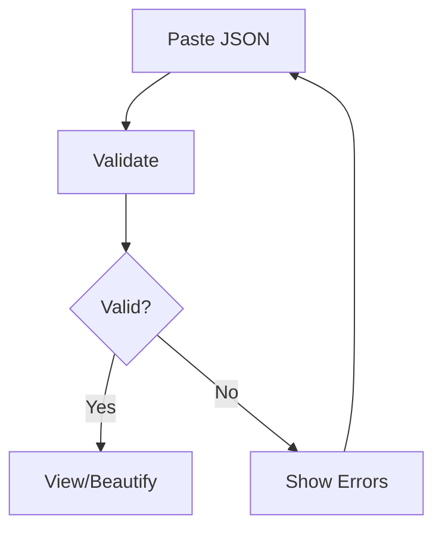

## Overview

JSON Viewer helps you view, validate, and beautify JSON data quickly in your browser. Paste or upload your JSON to explore nested structures, catch syntax errors, and format output for readability. You gain instant feedback without installing software.

<Columns cols={3}>
  <Card title="View Structures" icon="search" href="#viewing">
    Navigate deep object hierarchies effortlessly.
  </Card>
  <Card title="Validate Errors" icon="alert-triangle" href="#validating">
    Spot and fix syntax issues automatically.
  </Card>
  <Card title="Beautify JSON" icon="sparkles" href="#beautifying">
    Transform minified code into readable format.
  </Card>
</Columns>

## Viewing JSON Structures

Start by exploring complex JSON. Copy your data and use the viewer to expand nodes, search keys, and visualize arrays.

<Steps>
  <Step title="Paste Your JSON" icon="clipboard">
    Open JSON Viewer and paste data into the input area.
  </Step>
  <Step title="Expand Nodes" icon="chevron-down">
    Click arrows next to objects and arrays to drill down.
  </Step>
  <Step title="Search Keys" icon="search">
    Use the search bar to find specific properties quickly.
  </Step>
</Steps>

Here is a sample API response:

<CodeGroup tabs="Raw,Parsed">
  ```json
  {"user":{"id":123,"name":"Alice Johnson","orders":[{"id":456,"total":99.99},{"id":789,"total":149.50}]}}
  ```
  ```json
  {
    "user": {
      "id": 123,
      "name": "Alice Johnson",
      "orders": [
        {
          "id": 456,
          "total": 99.99
        },
        {
          "id": 789,
          "total": 149.50
        }
      ]
    }
  }
  ```
</CodeGroup>

## Validating JSON Data

Validate your JSON to detect errors like missing commas or invalid quotes. The tool highlights issues and suggests fixes.

<Callout kind="tip">
  Always validate before sharing or using JSON in applications.
</Callout>



<Tabs>
  <Tab title="Valid JSON" icon="check-circle">
    ```json
    {
      "product": {
        "name": "Laptop",
        "price": 1299.99
      }
    }
    ```
  </Tab>
  <Tab title="Invalid JSON" icon="x-circle">
    ```json
    {
      "product": {
        "name": "Laptop",
        "price": 1299.99
      },  // Missing closing brace
    ```
  </Tab>
</Tabs>

<Steps>
  <Step title="Check Syntax" icon="check">
    Paste JSON and click Validate. Green checkmark means success.
  </Step>
  <Step title="Fix Errors" icon="edit-3">
    Review highlighted lines and correct issues like trailing commas.
  </Step>
</Steps>

## Beautifying JSON Output

Beautify minified JSON for better readability. Choose indentation levels and copy the formatted result.

<Expandable title="Common Beautify Options" default-open="false">

Use 2-space indentation for compact views or 4 spaces for detailed code reviews.

| Option       | Indentation | Use Case                  |
|--------------|-------------|---------------------------|
| Compact     | 2 spaces   | Quick sharing             |
| Standard    | 4 spaces   | Code reviews              |
| Loose       | Tabs       | Legacy editor compatibility |

</Expandable>

<CodeGroup tabs="Minified,Beautified">
  ```json
  {"items":[{"name":"Book","price":24.99},{"name":"Pen","price":1.99}],"total":26.98}
  ```
  ```json
  {
    "items": [
      {
        "name": "Book",
        "price": 24.99
      },
      {
        "name": "Pen",
        "price": 1.99
      }
    ],
    "total": 26.98
  }
  ```
</CodeGroup>

<Callout kind="success">
  Save time by copying beautified JSON directly to your clipboard.
</Callout>

## Next Steps

Combine viewing, validating, and beautifying in your workflow. Upload files for larger datasets or integrate with your API testing process. JSON Viewer streamlines your daily JSON tasks.